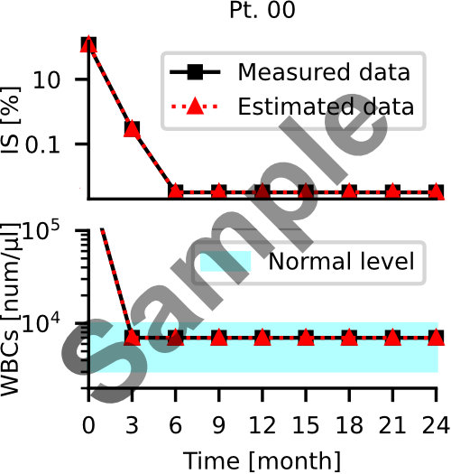
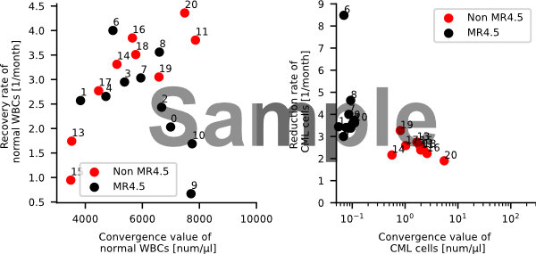
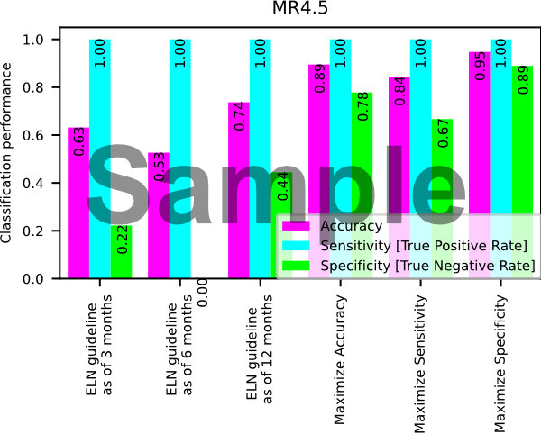

Early Dynamics of Chronic Myeloid Leukemia on Nilotinib Predicts Deep Molecular Response.
====
This readme text provides you how you run the application of the early prediction of tyrosine kinase inhibitor's response using time-series data of white blood cells (WBCs) and IS values. The enclosed codes were used in [our paper](https://doi.org/10.1038/s41540-022-00248-3).
The following text provides you the details of enclosed files and codes; the outputs of our application; requirements of computational environment; how you install and run our codes.

## Description
- ``data/`` - A directory which includes input data, i.e, the time-series of IS and WBC. At the time you get this directory,  all data within this directory are sample data which was generated artificially by ``mkValidationData.py``. When you apply our codes to the real clinical dataset, replace the sample with the data you use.

- ``data/IS_data.csv`` - Time-series data of IS values. Each row corresponds to each patient. Each cell of a row shows the IS value \[\%\] as of 0, 3, ...,24 months of the patient. The left end shows the patient ID and the top end shows the months.

- ``data/WBC_data.csv`` - Time-series data of WBC values. Each row corresponds to each patient. Each cell of a row shows the WBC counts \[num /micro l\] as of 0, 3, ...,24 months of the patient. The left end shows the patient ID and the top end shows the months.

- ``intermediate_data/`` - A directory which contains files corresponding to the optimized parameters and the results of the cross-validation test. These contained files are updated when you run some codes.

- ``out/`` - A directory which contains figure files. They are the time series of IS and WBCs, the scatter diagram of the optimized parameters, and bar graphs showing accuracy, sensitivity, and specificity for several prediction methods with the cross-validation test. These contained figures are updated when you run some codes.

- ``sample_img/`` - Samples of the above output figures.

- ``optimize_all.py`` - This code is used to estimate the parameters *a*,*b*,*c*,*xs*, and *ys* by using all the patients data.
These parameters are saved in the file ``intermediate_data/learned_data.csv``.
We note you have to prepare the files ``data/IS_data.csv`` and ``data/WBC_data.csv`` before you run this code.

- ``optimize_cross.py`` - This code is used to estimate the parameters *a*,*b*,*c*,*xs*, and *ys* for the leave-one-out cross-validation test. These parameters are saved in the file ``intermediate_data/learned_dataXX.csv``, where XX corresponds to the patient ID excluded in the parameter estimation.
We note you have to prepare the files ``data/IS_data.csv`` and ``data/WBC_data.csv`` before you run this code.

- ``visualization.py`` - This code is used to generate figures. The figure ``out/Estimeted_time_seriesXX.svg`` is the estimated time series of IS and WBCs. A figure ``out/parametersYYY.svg`` is the scatter diagram of the estimated parameters. 
We note you have to prepare the files ``data/IS_data.csv``,  ``data/WBC_data.csv``, and ``intermediate_data/learned_data.csv`` files before you run this code.

- ``validation.py`` - This code is used to generate a figure ``out/Score_YYY.svg`` that is the bar graph showing accuracy, sensitivity, and specificity for several prediction methods with the cross-validation test. We note you have to prepare the files
``data/IS_data.csv``, ``data/WBC_data.csv``, and ``intermediate_data/learned_dataXX.csv`` files before you run this code.

- ``mkValidationData.py`` - This code is used to artificially generate sample data of the IS values and WBC counts. These data are saved in``data/IS_data.csv`` and  ``data/WBC_data.csv``, respectively.
***REMARK*** this code overwrites all the data within the ``data/`` directory.  


---
The following files are generated after you run our codes.

- ``intermediate_data/learned_data.csv`` - Estimated parameters are summarized in this csv file. Each column corresponds to each patient. The calculated parameters *a*,*b*,*c*,*xs*,*ys*, and values of the loss function at the end of the calculation are shown for each column.

- ``intermediate_data/learned_dataXX.csv`` - Estimated parameters are summarized in this csv file in the case of the leave-ont-out cross-validation test. XX corresponds to the patient ID which was excluded in the estimation of optimize_cross.py.
- ``intermediate_data/Score_YYY.csv`` - Classification of the prediction results for several methods in terms of the  leave-one-out cross-validation test.YYY represents the criterion of the effectiveness of drug response for CML patients. Detail definitions are introduced in the method section of our paper.

- ``intermediate_data/ref_para.csv`` - Parameter set used in artificial data generation ``mkValidationData.py``.

- ``out/Estimeted_time_seriesXX.svg`` - Output figures of the estimated and observed time series of IS values and WCSs of the XX patient.
The optimized parameters *a*,*b*,*c*,*xs*, and *ys* are used in the calculation of these estimated time series

- ``out/parametersYYY.svg`` - Output figures of the scatter diagram of the optimized parameters *a*,*b*,*xs*, and *ys*. YYY represents the criterion of the effectiveness of drug response for CML patients. Detail definitions are introduced in the method section of our paper.

- ``out/Score_YYY.svg`` - Output figures of the  bar graphs showing accuracy, sensitivity, and specificity for several prediction methods with the cross-validation test. YYY represents the criterion of the effectiveness of drug response for CML patients. Detail definitions are introduced in the method section of our paper.


## Requirement
The enclosed codes were checked by macOS Catalina 10.15.3.
And they require the following environment:

- python 3.7.4
- pandas 0.25.2              
- numpy 1.17.3              
- matplotlib 3.1.1               
- tensorflow 1.15.0

If you already installed ``pip`` 19.0 or later, please execute the following one-sentence code:
```code
pip install pandas matplotlib tensorflow==1.15
```
This code usually ends within several minutes.

## Install
Download the current directory.

## Usage and Demo
1. Before you apply the above codes to your real data-set, replace ``data/IS_data.csv`` and ``data/WBC_data.csv`` with your data.

2. Run the following codes on the current directory:
``` codes
python optimize_all.py
python visualization.py
```

Then, you can get the estimated time series of IS and WBCs as 



``out/Estimeted_time_seriesXX.svg``

and the  scatter diagrams of the estimated parameters as 




``out/parametersXXX.svg``

Above files are found in the ``out/`` directory.
These codes usually end within 4-6 hours.


3. Run the following codes:
``` codes
python optimize_cross.py
python validation.py
```
Then, you can get the bar graphs showing accuracy, sensitivity, and specificity for several prediction methods with the cross-validation test as



``out/Score_XXX.svg``

They are found in the ``out/`` directory.
This code usually ends within 5-6 days.

## License
   Copyright 2020 Yuji Okamoto @ The University of Tokyo

   Licensed under the Apache License, Version 2.0 (the "License");
   you may not use this file except in compliance with the License.
   You may obtain a copy of the License at

       http://www.apache.org/licenses/LICENSE-2.0

   Unless required by applicable law or agreed to in writing, software
   distributed under the License is distributed on an "AS IS" BASIS,
   WITHOUT WARRANTIES OR CONDITIONS OF ANY KIND, either express or implied.
   See the License for the specific language governing permissions and
   limitations under the License. 

## Version
0.1.0

The change log file is [here](CHANGELOG.md).

## Code Author

Yuji Okamoto : yuji.0001@gmail.com

Masashi K. Kajita : masashi.k.kajita@gmail.com
